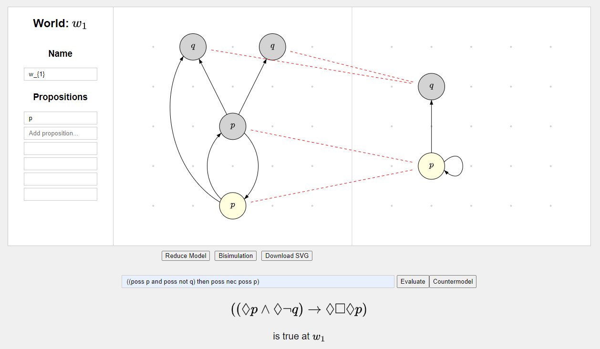

# Modal Logic Model Explorer

## Overview

This repository implements a [web application](https://jakobhausladen.github.io/Modal-Logic-Model-Explorer/), written in pure JavaScript, that allows users to explore core semantic concepts of modal logic interactively.

### Key Features:
- **Create and modify pointed Kripke models.**
- **Enter and evaluate modal formulas.**
- **Check validity using a Tableaux algorithm.**
- **Generate counter-models using a Tableaux algorithm.**
- **Check for bisimilarity between models with a partition refinement algorithm.**
- **Reduce models to their minimal bisimilar counterparts.**

## UI Explanation

Below is an example of the application interface. On the left, a model is drawn, and on the right, its reduced bisimilar model is displayed. The formula is evaluated as true at the selected world.

  
*Figure: Example of the app interface.*

### Main Components:
- **Main Drawing Board** (left):
  - Use to draw Kripke models.
  - **Right-click** to add or remove worlds.
  - **Left-click** to select and drag worlds.
  - Hold **Shift** and left-click between worlds to add or remove links.
  - Link styles (e.g., straight or curved) depend on relative click positions.

- **Secondary Drawing Board** (right):
  - Compare or visualize models generated from the main board.

- **Side Panel**:
  - View and edit properties (e.g., name, atoms) of the selected world.

- **Toolbar** (below the main board):
  - `Reduce Model`: Minimizes the model on the left and displays it on the right.
  - `Bisimulation`: Computes and displays the maximal bisimulation relation.
  - `Download SVG`: Exports both boards as a combined SVG file.

- **Formula Bar** (bottom):
  - Enter modal formulas using this syntax:  
    `A := not B, poss B, nec B, (B and C), (B or C), (B then C)`
  - `Evaluate`: Parses, renders, and evaluates the formula at the selected world.
  - `Countermodel`: Generates a minimal model where the formula is false.

## Documentation

- `World`
  - Represents a possible world.
  - Has an index, a name, and a set of atoms.

- `AccessibilityRelation`
  - Manages connections between worlds.
  - Has an index and a name.
  - Links are stored in the form of a `DefaultMap` which maps each world onto its set of accessible worlds.

- `PointedModel`
  - Represents a pointed Kripke model.
  - Manages a set of world one of which is selected and an array of relations between them.
  - Manages a list of observers, allows them to attach and notifies them if the model state changes.

- `PartitionRefinement`
  - Implements a partition refinement algorithm to construct the coarsest bisimulation partition of a model.
  - The induced equivalence relation is the maximal bisimulation over the model
  - Based on this algorithm it provides:
      - a method for reducing a model to its **minimal bisimilar couterpart**.
      - a method for constructing the **maximal bisimulation** between two models.

- `WorldUI`
  - Observes model and creates input elements to display and modify world properties, i.e. name and atoms.
  - Updates the model's selected world with the values entered in the input elements.

- `Formula` and subclasses
  - Represent formula objects in the language of modal logic.
  - Syntax: `A := not B, poss B, nec B, (B and C), (B or C), (B then C)`
  - Recursively evaluate their truth value and render MathJax representation.

- `FormulaUI`
  - Uses the `FormulaParser` class to create a formula from user input.
  - Renders the LaTeX representation of the formula using `MathJax`.
  - Observes a model and displayes the truth value of the formula at the selected world of the model.

- `ModelUI`
  - Responsible for editing and displaying a given model which it observes.
  - Has an SVG group element on which to draw worlds and links.
  - Stores world positions and information on how to draw links.
  - Manages various click events to draw, remove, and drag worlds/links.

- `DualModalUI`
  - Has two models.
  - Initializes the SVG 1000 x 500.
  - Appends two SVG group elements with a 500 x 500 rectangle, placed at (0,0) and (500,0).
  - Initializes two modelUIs. Each gets one of the models and one of the SVG groups.

  - Manages which model the `WorldUI` and `FormulaUI` observe:
      - Observes both models.
      - If a model is updated and a certain condition is met (such as a change in the selected world), set this model as active.
      - Make worldUI and formulaUI detach from their current model and attach to the active model.

  - Manages cross-model operations:
      - Using the `PartitionRefinement` class, reduces the left model to its minimal bisimilar couterpart and gives it to the right modelUI.
      - Using the `PartitionRefinement` class, constructs and draws a bisimulation between the left and right model.